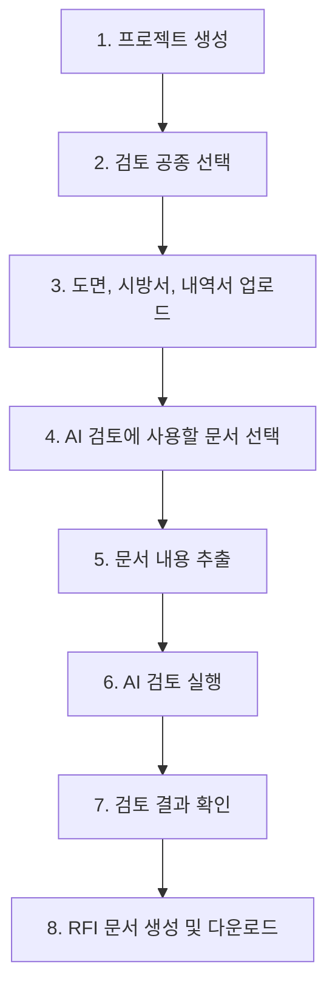
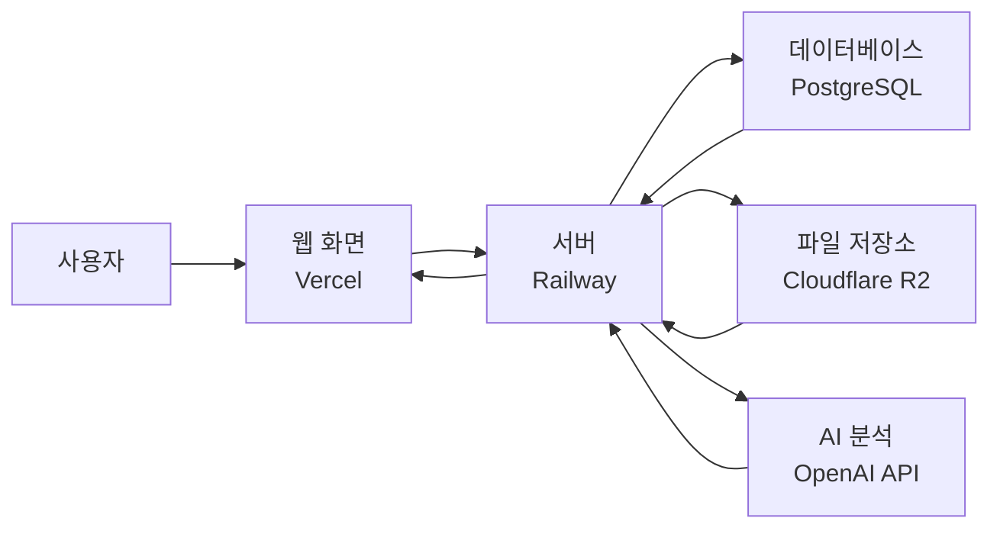

# 콘마(CONMA, Construction Master)

콘마는 **소규모 건설공사의 설계도서 검토를 돕는 AI-CM 보조 서비스**입니다.

도면, 시방서, 내역서를 프로젝트별로 업로드하면 서버가 문서 내용을 읽고, AI가 먼저 확인해야 할 설계관리 위험 항목을 정리합니다.  
AI가 최종 판단을 대신하는 서비스가 아니라, 담당자가 빠르게 확인할 수 있도록 **1차 검토 후보를 분류**하는 서비스입니다.

## 서비스 주소

- 웹사이트: https://ai-cm-review.vercel.app
- 서버 상태 확인: https://ai-cm-production.up.railway.app/api/health

## 누구를 위한 서비스인가요?

- 30억 미만 소규모 공사를 수행하는 중소 시공사
- 종합건설사와 전문건설사
- 설계도서 검토 인력이 부족해 우선 확인 항목을 빠르게 파악해야 하는 현장

## 핵심 목표

콘마의 목표는 설계도서를 완벽하게 해석하는 것이 아닙니다.

목표는 다음과 같습니다.

1. 문서 간 서로 맞지 않는 내용을 빠르게 찾기
2. 발주처, 설계자, 감리단에 질의해야 할 RFI 후보 정리
3. 설계변경 검토가 필요해 보이는 항목 표시
4. 공사비에 영향을 줄 수 있는 항목 표시
5. 프로젝트별로 문서와 결과가 섞이지 않게 관리

## 현재 구현된 기능

### 1. 프로젝트 생성 및 관리

- 공사별 프로젝트를 생성할 수 있습니다.
- 프로젝트별로 문서, 추출 결과, AI 검토 결과, RFI 문서가 분리됩니다.
- 프로젝트 내용을 수정하거나 삭제할 수 있습니다.
- 프로젝트 생성 시 검토할 공종 범위를 선택할 수 있습니다.

### 2. 문서 업로드

- 도면, 시방서, 내역서를 종류별로 업로드할 수 있습니다.
- 같은 종류의 문서도 여러 개 업로드할 수 있습니다.
- 업로드한 문서는 시간 순서대로 저장됩니다.
- 잘못 올린 문서는 삭제할 수 있습니다.
- AI 검토 실행 시 사용할 문서를 직접 선택할 수 있습니다.

### 3. 문서 내용 추출

서버가 업로드한 문서를 읽어 AI 검토에 사용할 텍스트로 정리합니다.

현재 직접 읽을 수 있는 문서는 다음과 같습니다.

- 도면: PDF, 이미지 파일(`.jpg`, `.jpeg`, `.png`, `.webp`)
- 시방서: PDF, `.hwpx`
- 내역서: Excel 파일(`.xlsx`, `.xlsm`)

참고 사항:

- 구형 `.hwp` 파일은 현재 직접 읽지 않습니다. 한글에서 `.hwpx` 또는 PDF로 저장한 뒤 업로드하는 방식이 안전합니다.
- 구형 Excel `.xls` 파일은 현재 직접 읽지 않습니다. Excel에서 `.xlsx`로 다시 저장한 뒤 업로드해 주세요.
- PDF 도면이나 이미지 도면은 OCR을 사용하므로 파일 크기와 선명도에 따라 시간이 더 걸릴 수 있습니다.

### 4. AI 검토

AI 검토 결과는 아래 4가지로 나누어 표시됩니다.

- 문서 내용이 너무 많으면 서버가 자동으로 여러 묶음으로 나누어 AI 검토를 실행합니다.
- 내역서처럼 행이 많은 문서는 품명, 규격, 수량, 단가, 금액 등 필요한 항목 중심으로 압축해 검토합니다.

| 구분 | 의미 |
| --- | --- |
| 설계도서 불일치 | 도면, 시방서, 내역서 사이에 서로 맞지 않거나 누락된 내용 |
| RFI 후보 | 발주처, 설계자, 감리단에 공식 질의가 필요해 보이는 내용 |
| 설계변경 검토 | 단순 확인을 넘어 설계변경 검토가 필요해 보이는 내용 |
| 공사비 영향 | 내역 누락, 물량 차이, 신규 단가 등 공사비에 영향을 줄 수 있는 내용 |

### 5. 검토 결과 확인

- 검토 결과는 카테고리별로 나누어 볼 수 있습니다.
- 결과가 많아져도 화면이 무한히 길어지지 않도록, 선택한 카테고리만 볼 수 있게 구성했습니다.
- 결과 조건에서 일자, 공종, 유형을 선택해 필요한 결과만 확인할 수 있습니다.
- 항목을 선택하면 상세 내용, 확인 위치, 권장 조치, RFI 초안을 볼 수 있습니다.

### 6. RFI 문서 자동 생성

- 한 프로젝트에서 발견된 RFI 후보를 한 번에 묶어 RFI 문서로 생성할 수 있습니다.
- 제공된 Word 양식을 기준으로 문서를 생성합니다.
- RFI 번호 형식은 `RFI-년도-발행번호` 방식입니다.
- 생성된 RFI 문서는 저장소에 보관됩니다.
- 이후에도 생성된 RFI 문서 목록에서 다시 다운로드할 수 있습니다.

## 화면 구성

### 메인 화면

메인 화면은 콘마의 정체성과 사용 흐름을 보여주는 소개 화면입니다.

현재 메인 화면 구성은 다음과 같습니다.

- 상단 `CONMA` 브랜드 바
- 큰 콘마 아이콘과 짧은 서비스 설명
- 스크롤에 따라 바뀌는 1~6단계 설명
- 오른쪽 단계 점 표시
- `SCROLL · STORY` 안내

메인 화면은 서비스 소개에 집중하고, 실제 작업 화면은 별도 탭에서 사용하도록 분리했습니다.

### 작업 화면

메인 화면을 제외한 작업 화면에서는 왼쪽 사이드바가 계속 보입니다.

작업 화면 탭은 다음과 같습니다.

- 대시보드
- 프로젝트 관리
- 문서 업로드
- 추출 결과
- 검토 결과

이렇게 구성한 이유는 작업 중에는 메뉴가 항상 보여야 이동이 편하기 때문입니다.

## 사용 흐름

## 서비스 구조

쉽게 말하면 다음과 같습니다.

- **Vercel**: 사용자가 접속하는 웹사이트
- **Railway**: 파일 업로드, 문서 분석, AI 검토를 처리하는 서버
- **PostgreSQL**: 프로젝트와 검토 결과를 저장하는 데이터베이스
- **Cloudflare R2**: 업로드 문서와 RFI 문서를 보관하는 파일 저장소
- **OpenAI API**: 문서 내용을 바탕으로 검토 후보를 정리하는 AI

## AI가 판단하는 근거

AI는 문서를 바로 마법처럼 이해하는 것이 아니라, 다음 자료를 바탕으로 검토 후보를 정리합니다.

1. 서버가 추출한 문서 텍스트
2. 엑셀 내역서의 여러 시트에서 읽은 항목
3. PDF와 이미지에서 OCR로 읽은 글자
4. 선택한 프로젝트의 검토 공종
5. 규칙 기반으로 먼저 찾아낸 누락, 물량 차이, 공종 키워드
6. AI에게 전달되는 분류 기준

따라서 AI 결과는 최종 확정이 아니라 **확인 후보**입니다.

## AI 검토 결과를 4가지로 나누는 이유

검토 결과를 한 목록으로만 보여주면 사용자가 무엇부터 처리해야 하는지 알기 어렵습니다.

그래서 콘마는 결과를 다음 목적에 맞게 나눕니다.

- **불일치**: 문서끼리 내용이 맞는지 확인
- **RFI 후보**: 공식 질의가 필요한지 확인
- **설계변경 검토**: 계약 또는 설계 변경 가능성 확인
- **공사비 영향**: 금액, 수량, 단가 영향 가능성 확인

이 구분은 현장에서 후속 조치를 정리하기 쉽게 만들기 위한 것입니다.

## 현재 지원하는 주요 공종

프로젝트 생성 시 검토 범위를 선택할 수 있습니다.

예시는 다음과 같습니다.

- 가설, 철거, 토공, 기초
- 콘크리트, 철근, 거푸집, 철골
- 조적, 미장, 방수, 단열
- 지붕, 석공, 타일, 도장
- 창호, 유리, 금속, 목공
- 조경, 토목, 전기, 조명, 통신
- 소방, 기계설비, 공조, 안전

선택한 공종은 AI 검토와 결과 필터에 활용됩니다.

## 중요한 한계

콘마는 설계자, 감리자, 공사관리자의 최종 판단을 대신하지 않습니다.

현재 한계는 다음과 같습니다.

- CAD 원본의 치수와 물량을 직접 계산하지는 않습니다.
- OCR은 도면 품질이 낮으면 글자를 잘못 읽을 수 있습니다.
- 복잡한 표나 병합 셀이 많은 내역서는 일부 항목을 놓칠 수 있습니다.
- AI 결과는 계약 변경이나 공사비 청구의 최종 근거가 아닙니다.
- 실제 RFI 발행, 설계변경, 금액 변경 전에는 반드시 담당자가 확인해야 합니다.

## 최근 최종 변경점

최근 화면과 사용성 개선 내용은 다음과 같습니다.

- 메인 화면을 브랜드 소개용 스크롤 화면으로 변경
- `CONMA` 상단 브랜드 바 적용
- `O` 위치에 콘마 아이콘 적용
- 메인 화면과 작업 화면의 메뉴 구조 분리
- 메인 화면은 상단 메뉴 버튼 방식 유지
- 작업 화면은 왼쪽 사이드바가 항상 보이도록 변경
- 메인 화면에서 브랜드 화면과 1~6단계 설명 화면 분리
- 오른쪽 단계 점 표시 추가
- 단계 점 클릭 시 해당 설명으로 이동
- 설명 문장이 자연스럽게 줄바꿈되도록 조정
- RFI 문서 생성 및 다운로드 목록 기능 추가

## 앞으로 추가하면 좋은 기능

- 검토 결과 Excel/PDF 다운로드
- OCR 정확도 표시
- 도면 번호와 시방서 조항 자동 연결
- 사용자 로그인 및 회사별 권한 관리
- 프로젝트별 작업자 초대
- RFI 발행 이력 관리
- 검토 결과 승인/보류 상태 관리
